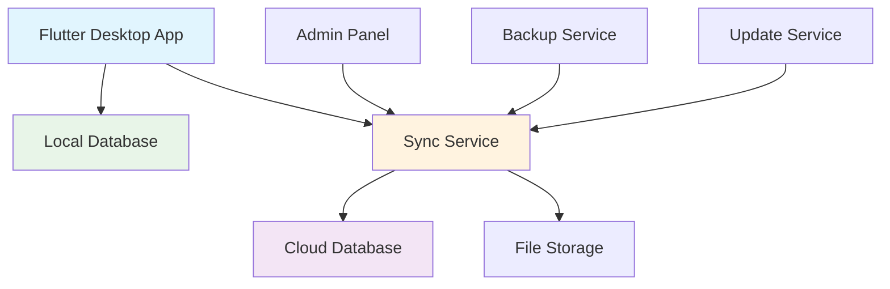
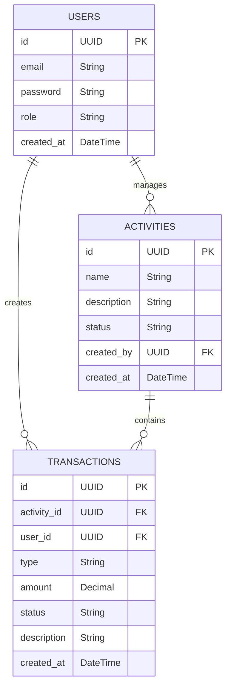
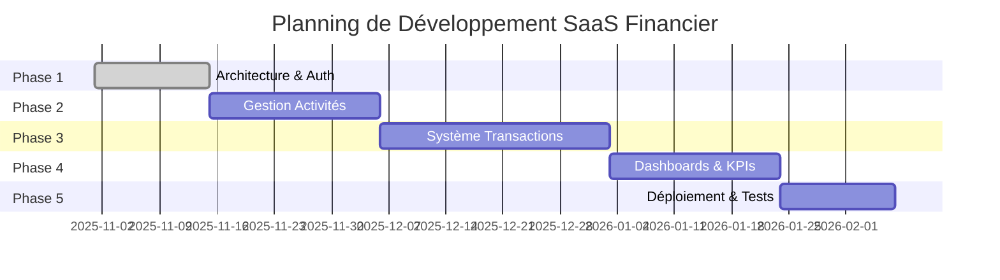

# Planification Complète - Logiciel de Gestion des Activités Financières

## 📋 SOMMAIRE EXÉCUTIF

**Objectif :** Développer un logiciel desktop de suivi des activités financières pour PME avec gestion multi-utilisateurs, dashboards en temps réel et suivi des transactions.

**Contraintes :**
- Petite entreprise (utilisateurs desktop individuels)
- Application desktop multi-plateforme (Windows/Mac/Linux)
- Base de données locale avec synchronisation optionnelle
- Équipe interne de développement
- Budget défini mais limité

---

## 🏗️ ARCHITECTURE TECHNIQUE

### Architecture Globale


### Stack Technologique Recommandée

**Application Desktop (Flutter) :**
- **Flutter Desktop** (Windows/Mac/Linux)
- **Dart** avec **TypeScript-style coding**
- **Material Design 3** (UI components)
- **fl_chart** (graphiques et KPIs)
- **Provider/Riverpod** (gestion d'état)

**Base de Données Locale :**
- **SQLite** via **sqflite** package
- **Drift** ORM (type-safe database access)
- **Hive** (local storage simple)

**Synchronisation (Optionnelle) :**
- **Supabase** (cloud database sync)
- **shared_preferences** (settings utilisateur)
- **updater** (mises à jour automatiques)

**Tools de Développement :**
- **Flutter SDK** (framework principal)
- **Dart Tests** (tests unitaires et integration)
- **Flutter Driver** (tests E2E desktop)

**Infrastructure :**
- **Database :** SQLite local + Supabase sync (optionnel)
- **Storage :** Fichiers locaux + backup cloud
- **Distribution :** Flutter build + installers natifs

### Architecture des Données



---

## 📅 PHASES DE DÉVELOPPEMENT

### Phase 1 : Fondations (4-6 semaines)
**Objectif :** Architecture de base et authentification

**Livrables :**
- Setup du projet Flutter Desktop avec Dart
- Configuration de la base de données
- Système d'authentification complet
- Gestion des rôles (Admin, Agent, User)
- Interface de connexion/inscription

**Tâches détaillées :**
- [x] Configuration de l'environnement de développement
- [ ] Création des modèles de données (User, Activity, Transaction)
- [ ] Implémentation de l'authentification JWT
- [ ] Création des middleware de sécurité
- [ ] Interface utilisateur de base (login/register)
- [ ] Tests unitaires des fonctions core

### Phase 2 : Gestion des Activités (3-4 semaines)
**Objectif :** CRUD complet des activités et assignation utilisateurs

**Livrables :**
- Interface de gestion des activités
- Assignation utilisateurs-activités
- Dashboard de base pour chaque utilisateur

**Tâches détaillées :**
- [ ] API CRUD pour les activités
- [ ] Interface de création/modification d'activités
- [ ] Système d'assignation des utilisateurs
- [ ] Vue liste des activités par utilisateur
- [ ] Filtres et recherche dans les activités

### Phase 3 : Système de Transactions (4-5 semaines)
**Objectif :** Gestion complète des recettes et dépenses

**Livrables :**
- CRUD des transactions
- Validation et workflow d'approbation
- Calculs automatiques des soldes

**Tâches détaillées :**
- [ ] API CRUD pour les transactions
- [ ] Interface de saisie des recettes/dépenses
- [ ] Système de validation/approbation
- [ ] Calculs automatiques (soldes, reste à collecter)
- [ ] Historique et traçabilité des modifications

### Phase 4 : Dashboards et Reporting (3-4 semaines)
**Objectif :** Visualisation des données et KPIs

**Livrables :**
- Dashboard global avec 4 KPIs
- Dashboards individuels par activité
- Listes des transactions en attente

**Tâches détaillées :**
- [ ] Composants de graphiques (fl_chart)
- [ ] Calcul des KPIs globaux
- [ ] Calcul des KPIs par activité
- [ ] Interface de reporting
- [ ] Exports CSV/PDF

### Phase 5 : Optimisation et Déploiement (2-3 semaines)
**Objectif :** Mise en production et optimisations

**Livrables :**
- Application déployée
- Tests d'intégration
- Documentation utilisateur

**Tâches détaillées :**
- [ ] Tests end-to-end (Flutter Driver/Integration Tests)
- [ ] Optimisation des performances
- [ ] Configuration CI/CD
- [ ] Packaging et distribution (Windows/Mac/Linux installers)
- [ ] Documentation technique et utilisateur

---

## 📊 CALENDRIER DE LIVRAISON



**Durée totale estimée :** 16-20 semaines (4-5 mois)

### Jalons de Livraison

| Jalon | Date Estimée | Livrable |
|-------|--------------|----------|
| Alpha (MVP Auth + Activities) | Mi-décembre 2025 | Version de test interne |
| Beta (Fonctionnalités Core) | Fin janvier 2026 | Version test utilisateurs |
| Production (Full Features) | Mi-mars 2026 | Version finale déployée |

---

## ⚠️ IDENTIFICATION DES RISQUES

### Risques Techniques

| Risque | Impact | Probabilité | Solution |
|--------|--------|-------------|----------|
| Limitations hébergement gratuit | Moyen | Élevée | Migration vers AWS/DigitalOcean si nécessaire |
| Performance base de données | Élevé | Moyen | Optimisation requêtes + Redis cache |
| Sécurité des données | Élevé | Faible | Chiffrement + audits réguliers |

### Risques Projet

| Risque | Impact | Probabilité | Mitigation |
|--------|--------|-------------|------------|
| Retards développement | Élevé | Moyen | Phases modulaires, MVP progressif |
| Manque d'expérience équipe | Moyen | Faible | Formation + mentor technique |
| Changement des besoins | Moyen | Élevé | Communication client constante |

### Contraintes d'Application Desktop

**Limitations identifiées :**
- Taille de l'application (max 100MB)
- Performance sur machines anciennes
- Mises à jour utilisateur (nécessite mise à jour manuelle)
- Sécurité locale des données
- Compatibilité multi-plateforme

**Solutions recommandées :**
- Code splitting et lazy loading
- Base de données optimisée (SQLite)
- Système de mise à jour automatique
- Chiffrement local des données sensibles
- Tests sur différentes configurations matérielles

---

## 🔧 SPÉCIFICATIONS TECHNIQUES DÉTAILLÉES

### Services Principaux (Locaux)

```dart
// Authentication Service
class AuthService {
  Future<User> login(String email, String password);
  Future<User> register(UserData userData);
  void logout();
  User? getCurrentUser();
  Future<void> updatePassword(String newPassword);
}

// Activities Service
class ActivitiesService {
  Future<List<Activity>> getAll();
  Future<Activity> create(ActivityData activity);
  Future<Activity> update(String id, ActivityData activity);
  Future<void> delete(String id);
  Future<void> assignUsers(String activityId, List<String> userIds);
}

// Transactions Service
class TransactionsService {
  Future<List<Transaction>> getAll({String? activityId});
  Future<Transaction> create(TransactionData transaction);
  Future<Transaction> update(String id, TransactionData transaction);
  Future<void> delete(String id);
  Future<Transaction> approve(String id);
  Future<Transaction> reject(String id, String reason);
}

// Dashboard Service
class DashboardService {
  Future<GlobalKPIs> getGlobalKPIs();
  Future<ActivityKPIs> getActivityKPIs(String activityId);
  Future<List<Transaction>> getPendingTransactions();
}

// Database Service
class DatabaseService {
  Future<void> init();
  Future<String> backup();
  Future<void> restore(String backupPath);
  Future<void> syncToCloud();
}
```

### Structure des Rôles

**Administrateur :**
- Accès complet (CRUD sur tout)
- Gestion des utilisateurs
- Vue globale de tous les dashboards
- Configuration système

**Agent du Service Intermédiaire :**
- CRUD sur les transactions assignées
- Fermeture d'activités
- Transferts vers caisse centrale
- Consultation des journaux

**Utilisateur Standard :**
- Création de recettes/dépenses
- Consultation de ses transactions
- Vue limitée aux activités assignées

### Modèles de Données

```dart
// User Model
class User {
  final String id;
  final String email;
  final String password; // hashed
  final String role; // 'admin' | 'agent' | 'user'
  final String firstName;
  final String lastName;
  final DateTime createdAt;
  final DateTime updatedAt;
  final bool isActive;
  
  const User({
    required this.id,
    required this.email,
    required this.password,
    required this.role,
    required this.firstName,
    required this.lastName,
    required this.createdAt,
    required this.updatedAt,
    required this.isActive,
  });
}

// Activity Model
class Activity {
  final String id;
  final String name;
  final String description;
  final String type; // 'magasin' | 'transport' | 'autre'
  final String status; // 'active' | 'closed' | 'suspended'
  final String createdBy; // userId
  final List<String> assignedUsers; // userIds
  final DateTime createdAt;
  final DateTime updatedAt;
  
  const Activity({
    required this.id,
    required this.name,
    required this.description,
    required this.type,
    required this.status,
    required this.createdBy,
    required this.assignedUsers,
    required this.createdAt,
    required this.updatedAt,
  });
}

// Transaction Model
class Transaction {
  final String id;
  final String activityId;
  final String userId;
  final String type; // 'recette' | 'depense'
  final double amount;
  final String status; // 'pending' | 'approved' | 'rejected'
  final String description;
  final DateTime date;
  final DateTime createdAt;
  final DateTime updatedAt;
  final String? approvedBy;
  
  const Transaction({
    required this.id,
    required this.activityId,
    required this.userId,
    required this.type,
    required this.amount,
    required this.status,
    required this.description,
    required this.date,
    required this.createdAt,
    required this.updatedAt,
    this.approvedBy,
  });
}
```

---

## 📈 ÉTAPES DE MISE EN ŒUVRE

### Pré-requis Techniques

1. **Environnement de développement**
   - Flutter SDK 3.0+ (stable channel)
   - Dart SDK (inclus avec Flutter)
   - Git + GitHub/GitLab
   - VS Code avec extension Flutter/Dart
   - Android Studio (pour debugging)

2. **Comptes de services**
   - Supabase (cloud sync optionnel)
   - GitHub (code repository + releases)
   - Code signing certificate (Windows/Mac)
   - Flutter build tools (inclus)

### Structure du Projet

```
/
├── lib/
│   ├── main.dart           # Point d'entrée de l'app
│   ├── core/               # Configuration et utilitaires
│   │   ├── constants/      # Constantes de l'app
│   │   ├── database/       # Configuration SQLite/Drift
│   │   └── utils/          # Utilitaires généraux
│   ├── features/           # Fonctionnalités modulaires
│   │   ├── auth/           # Authentification
│   │   ├── activities/     # Gestion des activités
│   │   ├── transactions/   # Gestion des transactions
│   │   └── dashboard/      # Dashboards et KPIs
│   ├── shared/             # Composants et services partagés
│   │   ├── models/         # Modèles de données
│   │   ├── services/       # Services locaux
│   │   ├── widgets/        # Widgets réutilisables
│   │   └── providers/      # State management
│   └── styles/             # Thèmes et styles
├── assets/                  # Images, fonts, etc.
├── test/                   # Tests unitaires
├── android/                # Configuration Android
├── ios/                    # Configuration iOS
├── windows/                # Configuration Windows
├── macos/                  # Configuration macOS
└── linux/                  # Configuration Linux
```

---

## 💰 ESTIMATION DES COÛTS

### Coûts de Développement (Internes)

| Phase | Durée | Ressources | Coût Estimé |
|-------|-------|------------|-------------|
| Phase 1-2 | 8-10 sem. | 2 développeurs | 40-50k € |
| Phase 3-4 | 7-9 sem. | 2 développeurs | 35-45k € |
| Phase 5 | 2-3 sem. | 1 développeur | 10-15k € |
| **Total** | **17-22 sem.** | **Équipe mixte** | **85-110k €** |

### Coûts d'Infrastructure (Mensuel)

| Service | Plan Gratuit | Plan Payant | Quand Migrer |
|---------|--------------|-------------|--------------|
| Supabase Sync | ✅ | 25€/mois | Si >5GB data sync |
| GitHub Releases | ✅ | 4€/mois | Si >500MB storage |
| Cloud Backup | ✅ | 9€/mois | Si >10GB backup |
| **Total** | **0€/mois** | **38€/mois** | **Après 12 mois** |

---

## 🎯 RECOMMANDATIONS STRATÉGIQUES

### Approche Progressive

1. **Start Small :** Commencer avec un MVP fonctionnel
2. **Validate Fast :** Tester avec 5-10 utilisateurs réels rapidement
3. **Iterate :** Améliorer basé sur les retours utilisateurs
4. **Scale :** Migrer vers infrastructure payante si nécessaire

### Priorités de Développement

**Must Have (Phase 1-2) :**
- Authentification sécurisée
- CRUD activités de base
- Interface simple et intuitive

**Should Have (Phase 3-4) :**
- Workflow d'approbation
- Dashboards et KPIs
- Rapports de base

**Could Have (Phase 5+) :**
- Mobile app

### Métriques de Succès

**Techniques :**
- Temps de chargement < 3 secondes
- Uptime > 99%
- Support de 100+ utilisateurs simultanés

**Business :**
- Adoption par 80% des employés ciblés
- Réduction de 50% du temps de suivi financier
- Zéro perte de données

---

## 📋 CHECKLIST DE VALIDATION

### Architecture
- [ ] Stack technologique validée par l'équipe
- [ ] Hébergement gratuit compatible avec les besoins
- [ ] Sécurité des données ensured
- [ ] Scalabilité考虑了 (migrations futures)

### Développement
- [ ] Modèles de données validés
- [ ] API design approuvé
- [ ] Rôles et permissions définis
- [ ] Tests stratégie established

### Déploiement
- [ ] CI/CD pipeline configuré
- [ ] Monitoring et logging setup
- [ ] Backup stratégie defined
- [ ] Documentation utilisateur ready

---

*Document créé le 30/10/2025 - Version 1.0*