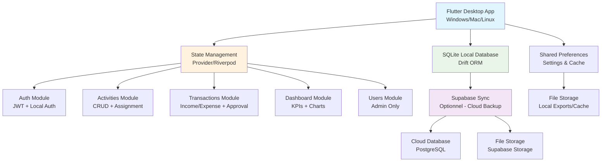

# Synthèse Architecturale - FinTrack Pro
## Analyse Complète et Plan d'Implémentation Flutter Desktop

---

## 📋 RÉSUMÉ EXÉCUTIF

**Projet :** FinTrack Pro - Logiciel Desktop de Gestion Financière d'Entreprise  
**Technologie :** Flutter Desktop Multi-Plateforme  
**Durée estimée :** 16-20 semaines  
**Équipe recommandée :** 2 développeurs Flutter/Dart  
**Budget :** 85-110k €  

**Objectif :** Créer une application desktop complète pour la gestion financière d'entreprise avec authentification, gestion d'activités, transactions, dashboards en temps réel et système de rôles multi-utilisateurs.

---

## 🎨 ANALYSE DES SPÉCIFICATIONS UX/UI

### Palette de Couleurs Unifiée
```dart
// Couleurs principales FinTrack Pro
class FinTrackColors {
  // Couleurs principales (vert)
  static const Color primary = Color(0xFF1A5554);      // Vert foncé - header, boutons primaires
  static const Color secondary = Color(0xFF2B7A78);    // Vert moyen - éléments interactifs
  static const Color accent = Color(0xFF3D9B99);       // Vert clair - hover states
  static const Color light = Color(0xFFE8F5F4);        // Vert pastel - backgrounds secondaires
  
  // Couleurs d'accentuation
  static const Color warning = Color(0xFFFFB800);      // Jaune/Ambre - alertes
  static const Color success = Color(0xFF10B981);      // Vert success - positif
  static const Color error = Color(0xFFEF4444);        // Rouge - erreurs
  static const Color info = Color(0xFF3B82F6);         // Bleu info
  
  // Couleurs neutres
  static const Color white = Color(0xFFFFFFFF);
  static const Color background = Color(0xFFF3F4F6);
  static const Color textSecondary = Color(0xFF9CA3AF);
  static const Color textPrimary = Color(0xFF1F2937);
}
```

### Composants UX/UI Mapeés vers Flutter

#### 1. Header de Navigation (80px hauteur)
```dart
// Header avec navigation principale, logo, notifications
class FinTrackHeader extends StatelessWidget {
  final User? currentUser;
  final int notificationCount;
  
  // Éléments : Logo, Navigation pills, Zone droite (settings, notifications, avatar)
  // États : hover (#3D9B99), active (#2B7A78 + border bottom)
  // Responsive : burger menu sur mobile
}
```

#### 2. Cards KPI Dashboard (4 cards horizontales)
```dart
// KPI Card avec icône, nombre principal (36px), badge pourcentage
class KPICard extends StatelessWidget {
  final String title;
  final double value;
  final double percentageChange;
  final IconData icon;
  final Color trendColor;
  
  // Design : Border radius 16px, padding 24px, shadow
  // KPI : 36px Bold, Badge : pill avec couleur selon tendance
  // Layout : Grid responsive (4→2→1 colonne)
}
```

#### 3. Cards Activités Éxpansibles
```dart
// Card activité avec état expandé/collapsé
class ActivityCard extends StatefulWidget {
  // Vue collapsée : nom, icône, menu 3 points, mini KPIs
  // Vue expandée : KPIs détaillés (5 indicateurs), transactions en attente (2 colonnes)
  // Actions : ajouter recette/dépense, clôturer activité
}
```

#### 4. Tableau Transactions avec Filtres
```dart
// Tableau avec colonnes : Date, Activité, Type, Libellé, Montant, Statut, Utilisateur
class TransactionTable extends StatelessWidget {
  // Fonctionnalités : tri, pagination (50 items), export CSV/Excel
  // Filtres : Activité, Type, Statut, Date range
  // Responsive : vue card sur mobile
}
```

#### 5. Gestion Utilisateurs (Admin uniquement)
```dart
// Interface CRUD utilisateurs avec rôles
class UserManagement extends StatelessWidget {
  // Formulaire : nom, email, rôle, activités assignées
  // Tableau : avatar, statuts, actions (modifier, supprimer, réinitialiser)
}
```

### Composants Réutilisables Flutter

```dart
// Boutons stylisés
class FinTrackButton extends StatelessWidget {
  // 3 variants : Primaire (vert foncé), Secondaire (outline), Danger (rouge)
  // Tailles : Small (10px 20px), Medium, Large
  // États : hover, active, disabled
}

// Form inputs stylisés
class FinTrackInput extends StatelessWidget {
  // Height : 48px, border radius : 10px, focus vert moyen
  // Types : text, password, email, date picker
}

// Badges de statut
class StatusBadge extends StatelessWidget {
  // Couleurs : En attente (jaune), Validé (bleu), Réalisé (vert), Rejeté (rouge)
  // Padding : 4px 12px, border radius : 8px, font : 12px Medium
}

// Modals de confirmation
class FinTrackModal extends StatelessWidget {
  // Overlay : rgba(0,0,0,0.5), max-width 600px, border-radius 20px
  // Structure : Header, Body, Footer avec boutons
}
```

---

## 🏗️ ARCHITECTURE TECHNIQUE UNIFIÉE

### Architecture Globale Flutter Desktop



### Stack Technologique Détaillé

#### Flutter Desktop Configuration
```yaml
# pubspec.yaml
flutter:
  sdk: flutter
  version: 3.0+ # Stable channel

platforms:
  windows:
    target: windows/flutter/CMakeLists.txt
  macos:
    target: macos/Flutter/Flutter-Debug.xcconfig
  linux:
    target: linux/flutter/generated_plugin_registrant.cc

dependencies:
  # Core Flutter
  flutter_localizations:
    sdk: flutter
  
  # State Management
  flutter_riverpod: ^2.4.9
  riverpod_annotation: ^2.3.3
  
  # Database
  drift: ^2.14.0
  sqlite3_flutter_libs: ^0.5.15
  path_provider: ^2.1.1
  
  # UI & Charts
  fl_chart: ^0.66.0
  cupertino_icons: ^1.0.6
  flutter_svg: ^2.0.9
  
  # Authentication & Security
  crypto: ^3.0.3
  shared_preferences: ^2.2.2
  jwt_decoder: ^2.0.1
  
  # Utilities
  intl: ^0.18.1
  uuid: ^4.2.1
  equatable: ^2.0.5
  
  # File Handling
  path: ^1.8.3
  file_picker: ^6.1.1
  excel: ^2.1.0
  
  # Sync (Optionnel)
  supabase_flutter: ^1.10.25
```

#### Structure Modulaire Flutter

```
lib/
├── main.dart                    # Point d'entrée + thème global
├── core/                        # Configuration & utilitaires
│   ├── constants/              # Couleurs, dimensions, routes
│   │   ├── colors.dart         # Palette FinTrack Pro
│   │   ├── app_constants.dart  # Routes, timings, etc.
│   │   └── dimensions.dart     # Breakpoints responsive
│   ├── database/               # Configuration Drift
│   │   ├── database.dart       # Database config principale
│   │   ├── tables/             # Tables entités
│   │   └── migrations/         # Migrations BDD
│   ├── utils/                  # Utilitaires généraux
│   │   ├── formatters.dart     # Formatage devise, dates
│   │   ├── validators.dart     # Validation formulaires
│   │   └── extensions.dart     # Extensions Dart utiles
│   └── services/               # Services transversaux
│       ├── auth_service.dart   # Service authentification
│       ├── sync_service.dart   # Synchronisation cloud
│       └── notification_service.dart
│
├── features/                    # Fonctionnalités modulaires
│   ├── auth/                   # Module authentification
│   │   ├── data/
│   │   │   ├── repositories/auth_repository.dart
│   │   │   └── datasources/auth_local_datasource.dart
│   │   ├── domain/
│   │   │   ├── repositories/auth_repository.dart
│   │   │   ├── entities/user.dart
│   │   │   └── usecases/login_usecase.dart
│   │   ├── presentation/
│   │   │   ├── providers/auth_provider.dart
│   │   │   ├── pages/login_page.dart
│   │   │   └── pages/register_page.dart
│   │   └── widgets/
│   │
│   ├── activities/             # Module gestion activités
│   │   ├── data/
│   │   ├── domain/
│   │   ├── presentation/
│   │   └── widgets/
│   │
│   ├── transactions/           # Module transactions
│   │   ├── data/
│   │   ├── domain/
│   │   ├── presentation/
│   │   └── widgets/
│   │
│   ├── dashboard/              # Module dashboards
│   │   ├── data/
│   │   ├── domain/
│   │   ├── presentation/
│   │   └── widgets/
│   │
│   └── users/                  # Module utilisateurs (Admin)
│       ├── data/
│       ├── domain/
│       ├── presentation/
│       └── widgets/
│
├── shared/                     # Composants partagés
│   ├── models/                 # Modèles de données
│   │   ├── user_model.dart
│   │   ├── activity_model.dart
│   │   └── transaction_model.dart
│   ├── widgets/                # Widgets réutilisables
│   │   ├── buttons/            # FinTrackButton variants
│   │   ├── cards/              # Cards KPI, Activity, etc.
│   │   ├── inputs/             # FinTrackInput variants
│   │   ├── charts/             # Widgets graphiques
│   │   └── modals/             # FinTrackModal
│   ├── providers/              # Providers Riverpod globaux
│   └── services/               # Services partagés
│
└── styles/                     # Thèmes et styles
    ├── app_theme.dart          # Thème principal FinTrack
    ├── text_styles.dart        # Typographie (Inter/Poppins)
    └── spacing.dart            # Système d'espacement
```

---

## 📊 MODÉLISATION DES DONNÉES UNIFIÉE

### Schéma de Base de Données Drift

```dart
// Import pour Drift
import 'package:drift/drift.dart';

// Table Utilisateurs
@DataClassName('UserEntity')
class Users extends Table {
  TextColumn get id => text().clientDefault(() => const Uuid().v4())();
  TextColumn get email => text()();
  TextColumn get password => text()(); // Hashé avec crypto
  TextColumn get role => text().check(
    (role).isIn(['admin', 'agent', 'user'])
  )();
  TextColumn get firstName => text()();
  TextColumn get lastName => text()();
  TextColumn get avatarUrl => text().nullable()();
  DateTimeColumn get createdAt => dateTime().withDefault(currentDateAndTime)();
  DateTimeColumn get updatedAt => dateTime().withDefault(currentDateAndTime)();
  BoolColumn get isActive => boolean().withDefault(const Constant(true))();
  
  @override
  Set<Column> get primaryKey => {id};
  
  @override
  List<Set<Column>> get uniqueKeys => [
    {email}
  ];
}

// Table Activités
@DataClassName('ActivityEntity')
class Activities extends Table {
  TextColumn get id => text().clientDefault(() => const Uuid().v4())();
  TextColumn get name => text()();
  TextColumn get description => text().nullable()();
  TextColumn get type => text().check(
    (type).isIn(['magasin', 'transport', 'autre'])
  )();
  TextColumn get status => text().check(
    (status).isIn(['active', 'closed', 'suspended'])
  )();
  TextColumn get createdBy => text().references(Users, #id)();
  TextColumn get color => text().nullable()(); // Couleur identitaire activité
  DateTimeColumn get createdAt => dateTime().withDefault(currentDateAndTime)();
  DateTimeColumn get updatedAt => dateTime().withDefault(currentDateAndTime)();
  DateTimeColumn? get closedAt => dateTime().nullable()();
  
  @override
  Set<Column> get primaryKey => {id};
}

// Table Association Utilisateur-Activité
@DataClassName('ActivityAssignmentEntity')
class ActivityAssignments extends Table {
  TextColumn get id => text().clientDefault(() => const Uuid().v4())();
  TextColumn get activityId => text().references(Activities, #id)();
  TextColumn get userId => text().references(Users, #id)();
  DateTimeColumn get assignedAt => dateTime().withDefault(currentDateAndTime)();
  BoolColumn get isActive => boolean().withDefault(const Constant(true))();
  
  @override
  Set<Column> get primaryKey => {id};
  
  @override
  List<Set<Column>> get uniqueKeys => [
    {activityId, userId}
  ];
}

// Table Transactions
@DataClassName('TransactionEntity')
class Transactions extends Table {
  TextColumn get id => text().clientDefault(() => const Uuid().v4())();
  TextColumn get activityId => text().references(Activities, #id)();
  TextColumn get userId => text().references(Users, #id)();
  TextColumn get type => text().check(
    (type).isIn(['recette', 'depense'])
  )();
  RealColumn get amount => real()();
  TextColumn get status => text().check(
    (status).isIn(['pending', 'approved', 'rejected', 'completed'])
  )();
  TextColumn get description => text()();
  DateTimeColumn get transactionDate => dateTime()();
  DateTimeColumn get createdAt => dateTime().withDefault(currentDateAndTime)();
  DateTimeColumn get updatedAt => dateTime().withDefault(currentDateAndTime)();
  TextColumn? get approvedBy => text().references(Users, #id).nullable()();
  DateTimeColumn? get approvedAt => dateTime().nullable()();
  TextColumn? get rejectionReason => text().nullable()();
  
  @override
  Set<Column> get primaryKey => {id};
}

// Table Notifications
@DataClassName('NotificationEntity')
class Notifications extends Table {
  TextColumn get id => text().clientDefault(() => const Uuid().v4())();
  TextColumn get userId => text().references(Users, #id)();
  TextColumn get type => text().check(
    (type).isIn(['activity_closed', 'new_user', 'pending_expense', 'alert_threshold'])
  )();
  TextColumn get title => text()();
  TextColumn get message => text()();
  BoolColumn get isRead => boolean().withDefault(const Constant(false))();
  TextColumn get data => text().nullable()(); // JSON avec données additionnelles
  DateTimeColumn get createdAt => dateTime().withDefault(currentDateAndTime)();
  
  @override
  Set<Column> get primaryKey => {id};
}

// Configuration Database AppDatabase
@DriftDatabase(tables: [
  Users,
  Activities,
  ActivityAssignments,
  Transactions,
  Notifications
])
class AppDatabase extends _$AppDatabase {
  AppDatabase(QueryExecutor e) : super(e);
  
  @override
  int get schemaVersion => 1;
  
  @override
  MigrationStrategy get migration => migrationStrategy;
  
  static MigrationStrategy get migrationStrategy => MigrationStrategy(
    onCreate: (Migrator m) async {
      await m.createAll();
    },
    onUpgrade: (Migrator m, int from, int to) async {
      if (from < 2) {
        // Migrations futures ici
      }
    },
  );
}
```

### Modèles de Domain (Clean Architecture)

```dart
// Modèles Domain - Business Logic
import 'package:equatable/equatable.dart';

class User extends Equatable {
  final String id;
  final String email;
  final UserRole role;
  final String firstName;
  final String lastName;
  final String? avatarUrl;
  final DateTime createdAt;
  final DateTime updatedAt;
  final bool isActive;
  
  const User({
    required this.id,
    required this.email,
    required this.role,
    required this.firstName,
    required this.lastName,
    this.avatarUrl,
    required this.createdAt,
    required this.updatedAt,
    required this.isActive,
  });
  
  // Méthodes utilitaires
  String get fullName => '$firstName $lastName';
  bool get isAdmin => role == UserRole.admin;
  bool get isAgent => role == UserRole.agent;
  bool get isStandardUser => role == UserRole.user;
  
  @override
  List<Object?> get props => [id, email, role, firstName, lastName];
}

enum UserRole {
  admin('admin'),
  agent('agent'),
  user('user');
  
  const UserRole(this.value);
  final String value;
}

class Activity extends Equatable {
  final String id;
  final String name;
  final String? description;
  final ActivityType type;
  final ActivityStatus status;
  final String createdBy;
  final List<String> assignedUsers;
  final String? color;
  final DateTime createdAt;
  final DateTime updatedAt;
  final DateTime? closedAt;
  
  // Calculs automatiques
  double get totalRecettes {
    // Calcul implémenté via repository
  }
  
  double get totalDepenses {
    // Calcul implémenté via repository
  }
  
  double get solde {
    return totalRecettes - totalDepenses;
  }
  
  bool get isActive => status == ActivityStatus.active;
  bool get isClosed => status == ActivityStatus.closed;
}

enum ActivityType {
  magasin('magasin'),
  transport('transport'),
  autre('autre');
  
  const ActivityType(this.value);
  final String value;
}

enum ActivityStatus {
  active('active'),
  closed('closed'),
  suspended('suspended');
  
  const ActivityStatus(this.value);
  final String value;
}

class Transaction extends Equatable {
  final String id;
  final String activityId;
  final String userId;
  final TransactionType type;
  final double amount;
  final TransactionStatus status;
  final String description;
  final DateTime transactionDate;
  final DateTime createdAt;
  final DateTime updatedAt;
  final String? approvedBy;
  final DateTime? approvedAt;
  final String? rejectionReason;
  
  // Utilitaires
  bool get isRecette => type == TransactionType.recette;
  bool get isDepense => type == TransactionType.depense;
  bool get isPending => status == TransactionStatus.pending;
  bool get isApproved => status == TransactionStatus.approved;
  bool get isCompleted => status == TransactionStatus.completed;
  
  @override
  List<Object?> get props => [id, activityId, type, amount, status];
}

enum TransactionType {
  recette('recette'),
  depense('depense');
  
  const TransactionType(this.value);
  final String value;
}

enum TransactionStatus {
  pending('pending'),
  approved('approved'),
  rejected('rejected'),
  completed('completed');
  
  const TransactionStatus(this.value);
  final String value;
}

// KPIs Calculés
class GlobalKPIs {
  final double totalRecettes;
  final double totalDepenses;
  final double resteACollecter;
  final double soldeGlobal;
  final double percentageChangeRecettes;
  final double percentageChangeDepenses;
  
  const GlobalKPIs({
    required this.totalRecettes,
    required this.totalDepenses,
    required this.resteACollecter,
    required this.soldeGlobal,
    required this.percentageChangeRecettes,
    required this.percentageChangeDepenses,
  });
}

class ActivityKPIs {
  final String activityId;
  final double recettesEnAttente;
  final double depensesEnAttente;
  final double recettesAcquises;
  final double depensesAcquises;
  final double resteDisponible;
  
  const ActivityKPIs({
    required this.activityId,
    required this.recettesEnAttente,
    required this.depensesEnAttente,
    required this.recettesAcquises,
    required this.depensesAcquises,
    required this.resteDisponible,
  });
}
```

---

## 📦 DÉPENDANCES ET PACKAGES FLUTTER

### Core Dependencies

```yaml
dependencies:
  # Flutter Framework
  flutter:
    sdk: flutter
  flutter_localizations:
    sdk: flutter
  
  # State Management (Riverpod recommandé)
  flutter_riverpod: ^2.4.9
  riverpod_annotation: ^2.3.3
  dev_riverpod_generator:
    dev: true
  dev_riverpod_graph:
    dev: true
  
  # Database (Drift ORM)
  drift: ^2.14.0
  sqlite3_flutter_libs: ^0.5.15
  path_provider: ^2.1.1
  path: ^1.8.3
  
  # UI & Charts
  fl_chart: ^0.66.0           # Graphiques KPI
  cupertino_icons: ^1.0.6     # Icons
  flutter_svg: ^2.0.9         # SVG support
  shimmer: ^3.0.0             # Loading states
  lottie: ^2.7.0              # Animations
  
  # Authentication & Security
  crypto: ^3.0.3              # Hashage mots de passe
  shared_preferences: ^2.2.2  # Settings utilisateur
  jwt_decoder: ^2.0.1         # Validation JWT
  
  # Utils
  intl: ^0.18.1               # Formatage dates/devise
  uuid: ^4.2.1                # Génération UUID
  equatable: ^2.0.5           # Égalité d'objets
  collection: ^1.17.2         # Collections utilitaires
  
  # File Handling
  file_picker: ^6.1.1         # Sélection fichiers
  excel: ^2.1.0               # Export Excel
  pdf: ^3.10.7                # Export PDF
  open_file: ^3.3.2           # Ouverture fichiers
  
  # Validation
  reactive_forms: ^17.0.1     # Formulaires réactifs
  reactive_validators: ^17.0.1 # Validation avancée
  
  # Date/Time
  time_machine: ^1.1.0        # Manipulation dates
  
  # Sync (Optionnel)
  supabase_flutter: ^1.10.25  # Sync cloud
  connectivity_plus: ^5.0.2   # État connexion
  
  # Platform Specific
  window_manager: ^0.3.7      # Gestion fenêtre desktop
  desktop_lifecycle: ^0.1.0   # Cycle de vie app desktop
```

### Development Dependencies

```yaml
dev_dependencies:
  flutter_test:
    sdk: flutter
  flutter_lints: ^3.0.0
  
  # Code Generation
  build_runner: ^2.4.7
  riverpod_generator:
  drift_dev:
  
  # Testing
  mockito: ^5.4.2
  integration_test:
    sdk: flutter
  
  # Code Quality
  very_good_analysis: ^5.1.0
  flutter_hooks: ^0.18.6
```

---

## 📅 PLAN D'IMPLÉMENTATION PAR PHASES

### Phase 1 : Fondations (4-6 semaines)

#### 1.1 Configuration Projet (Semaine 1)
```dart
// Setup Flutter Desktop avec structure modulaire
// Configuration Drift + SQLite
// Setup Riverpod providers
// Thème FinTrack (couleurs, typographie)
// Routing et navigation
```

#### 1.2 Modèles de Données (Semaine 1-2)
```dart
// Implémentation entités (User, Activity, Transaction)
// Tables Drift avec relations
// Migrations base de données
// Repositories patterns
```

#### 1.3 Authentification (Semaine 2-3)
```dart
// Service authentification avec hash
// Providers Riverpod auth
// Pages login/register (UI conforme specs)
// Gestion sessions locales
// Middleware protection routes
```

#### 1.4 Tests et Validation (Semaine 3-4)
```dart
// Tests unitaires modèles et repositories
// Tests intégration auth
// Validation sécurité et performance
// Optimisation initiale
```

**Livrables Phase 1 :**
- [ ] Application Flutter Desktop démarrable
- [ ] Base de données SQLite configurée avec Drift
- [ ] Système d'authentification complet (3 rôles)
- [ ] Interface login/register conforme design
- [ ] Tests unitaires de base

### Phase 2 : Gestion des Activités (3-4 semaines)

#### 2.1 CRUD Activités (Semaine 1-2)
```dart
// Repository et Service Activities
// UI liste activités (grid 2-3 colonnes)
// Formulaires création/modification
// Assignation utilisateurs-activités
```

#### 2.2 Interface Activités (Semaine 2-3)
```dart
// Cards expansibles (collapsé/expandé)
// Mini KPIs dans vue collapsée
// KPIs détaillés dans vue expandée
// Workflow transition états
```

#### 2.3 Permissions et Filtres (Semaine 3-4)
```dart
// Système de permissions par rôle
// Filtres et recherche activités
// Vue utilisateur personnalisé
// Tests et optimisation
```

**Livrables Phase 2 :**
- [ ] CRUD complet activités avec interface UI
- [ ] Cards expansibles avec KPIs
- [ ] Assignation utilisateurs-activités
- [ ] Système de permissions par rôle
- [ ] Filtres et recherche fonctionnels

### Phase 3 : Système de Transactions (4-5 semaines)

#### 3.1 CRUD Transactions (Semaine 1-2)
```dart
// Repository et Service Transactions
// Formulaires recettes/dépenses
// Validation et contraintes métier
// Interface de saisie intuitive
```

#### 3.2 Workflow d'Approbation (Semaine 2-3)
```dart
// Système validation/approbation
// États transactions (pending/approved/rejected)
// Notifications approbation
// Audit trail modifications
```

#### 3.3 Calculs Automatiques (Semaine 3-4)
```dart
// Calcul soldes en temps réel
// KPIs par activité
// Reste à collecter/collecté
// Mise à jour dashboard automatique
```

#### 3.4 Journal et Export (Semaine 4-5)
```dart
// Tableau transactions avec filtres avancés
// Export CSV/Excel
// Historique et traçabilité
// Performance et optimisation
```

**Livrables Phase 3 :**
- [ ] CRUD transactions complet
- [ ] Workflow d'approbation opérationnel
- [ ] Calculs automatiques temps réel
- [ ] Journal transactions avec filtres
- [ ] Exports CSV/Excel fonctionnels

### Phase 4 : Dashboards et Reporting (3-4 semaines)

#### 4.1 KPIs Globaux (Semaine 1-2)
```dart
// 4 cards KPI dashboard principal
// Calculs et mise à jour temps réel
// Graphiques fl_chart intégrés
// Design responsive (4→2→1 colonne)
```

#### 4.2 Dashboards Activités (Semaine 2-3)
```dart
// KPIs détaillés par activité
// Graphiques de performance
// Tendances temporelles
// Widgets configurables
```

#### 4.3 Notifications et Alertes (Semaine 3-4)
```dart
// Système notifications in-app
// Toast notifications
// Badge notifications header
// Workflow clôture d'activité
```

**Livrables Phase 4 :**
- [ ] Dashboard global avec 4 KPIs
- [ ] Dashboards par activité
- [ ] Système de notifications complet
- [ ] Graphiques et visualisations
- [ ] Workflow clôture d'activité

### Phase 5 : Optimisation et Déploiement (2-3 semaines)

#### 5.1 Gestion Utilisateurs Admin (Semaine 1)
```dart
// Interface CRUD utilisateurs (admin only)
// Gestion rôles et permissions
// Statistiques utilisateurs
// Formulaires complets avec validation
```

#### 5.2 Tests et Optimisation (Semaine 2)
```dart
// Tests end-to-end complets
// Tests performance sur machines anciennes
// Optimisation base de données
// Audit sécurité et données
```

#### 5.3 Packaging et Distribution (Semaine 2-3)
```dart
// Build Windows/Mac/Linux installers
// Configuration mise à jour automatique
// Documentation utilisateur
// Déploiement et monitoring
```

**Livrables Phase 5 :**
- [ ] Interface gestion utilisateurs (admin)
- [ ] Application packagée multi-plateforme
- [ ] Tests end-to-end validés
- [ ] Documentation complète
- [ ] Application déployée en production

---

## 🔄 SYNCHRONISATION CLOUD OPTIONNELLE

### Architecture Supabase (Optionnelle)

```dart
// Service de synchronisation avec Supabase
class CloudSyncService {
  final SupabaseClient _supabase;
  
  // Configuration optionnelle
  Future<void> enableSync() async {
    // Activation synchronisation cloud
    // Configuration règles de sécurité
    // Setup backup automatique
  }
  
  // Sync sélective par utilisateur
  Future<void> syncUserData(String userId) async {
    // Sync données utilisateur spécifique
    // Gestion conflits locaux/distants
    // Indicateur état sync
  }
  
  // Backup complet
  Future<String> createBackup() async {
    // Export base de données locale
    // Upload vers Supabase Storage
    // Retourne URL backup
  }
}
```

### Règles de Sécurité Supabase

```sql
-- Exemple RLS (Row Level Security)
CREATE POLICY "Users can only see their data" ON users
FOR ALL USING (auth.uid()::text = id);

CREATE POLICY "Admins can see all activities" ON activities
FOR ALL USING (
  EXISTS (
    SELECT 1 FROM users 
    WHERE users.id = auth.uid()::text 
    AND users.role = 'admin'
  )
);
```

---

## 📈 MÉTRIQUES ET MONITORING

### Métriques Techniques

```dart
// Service de monitoring
class MetricsService {
  // Performance
  Duration get appLaunchTime;
  int get databaseQueryCount;
  double get memoryUsage;
  bool get isLowPerformanceDevice;
  
  // Usage
  int get totalUsers;
  int get activeUsers;
  int get totalActivities;
  int get totalTransactions;
  
  // Business
  double get averageTransactionAmount;
  int get pendingApprovals;
  Duration get averageApprovalTime;
}
```

### Tableau de Bord Admin

```dart
// Dashboard administrateur avec métriques
class AdminDashboard extends StatelessWidget {
  @override
  Widget build(BuildContext context) {
    return Column(
      children: [
        // KPIs globaux utilisateurs
        Row(
          children: [
            KPICard(title: 'Total Utilisateurs', value: metrics.totalUsers),
            KPICard(title: 'Utilisateurs Actifs', value: metrics.activeUsers),
            KPICard(title: 'Actifs 30j', value: metrics.activeUsers30d),
            KPICard(title: 'Avg Session', value: metrics.averageSessionTime),
          ],
        ),
        // Graphiques utilisation
        ChartsSection(),
        // Alertes système
        AlertsSection(),
      ],
    );
  }
}
```

---

## 🚀 RÉCOMMANDATIONS D'IMPLÉMENTATION

### Priorités Techniques

1. **Architecture Modulaire** : Développer en modules indépendants (auth → activities → transactions → dashboard)
2. **Tests Préventifs** : Tests unitaires à chaque fin de module
3. **Performance Native** : Optimisation SQLite + requêtes indexées
4. **Sécurité Locale** : Hashage mots de passe + chiffrement données sensibles
5. **UX Responsive** : Design mobile-first adapté au desktop

### Configuration Développement

```yaml
# Configuration VS Code recommandée
{
  "dart.flutterSdkPath": "path/to/flutter",
  "dart.lineLength": 80,
  "editor.formatOnSave": true,
  "editor.codeActionsOnSave": {
    "source.fixAll": true
  }
}
```

### Scripts Utilitaires

```bash
# Génération code Drift
flutter packages pub run build_runner build

# Tests unitaires
flutter test

# Tests intégration
flutter drive --target=test_driver/app.dart

# Build releases
flutter build windows --release
flutter build macos --release
flutter build linux --release
```

---

## 📋 CHECKLIST DE VALIDATION

### Architecture Technique
- [ ] Stack Flutter Desktop validée par l'équipe
- [ ] Architecture modulaire Clean Architecture implémentée
- [ ] Base de données SQLite avec Drift configurée
- [ ] Synchronisation cloud Supabase optionnelle prête
- [ ] Sécurité et chiffrement des données implémentés

### Spécifications UX/UI
- [ ] Palette de couleurs FinTrack respectée
- [ ] Composants réutilisables développés (buttons, cards, inputs)
- [ ] Interface responsive (desktop → tablet → mobile)
- [ ] Animations et micro-interactions implémentées
- [ ] Accessibilité (contrastes, navigation clavier) respectée

### Fonctionnalités Métier
- [ ] 3 rôles utilisateurs (Admin, Agent, Utilisateur) opérationnels
- [ ] CRUD activités avec cards expansibles
- [ ] Système transactions avec workflow d'approbation
- [ ] 4 KPIs dashboard calculés en temps réel
- [ ] Workflow clôture d'activité automatisé
- [ ] Exports CSV/Excel fonctionnels

### Tests et Qualité
- [ ] Tests unitaires couverture > 80%
- [ ] Tests d'intégration end-to-end
- [ ] Tests performance sur machines anciennes
- [ ] Audit sécurité et données
- [ ] Documentation technique et utilisateur complète

### Déploiement
- [ ] Build Windows/Mac/Linux fonctionnels
- [ ] Installers packagés et testés
- [ ] Système mise à jour automatique configuré
- [ ] Monitoring et logs implémentés
- [ ] Process CI/CD configuré

---

## 💡 CONCLUSION

Cette synthèse architecturale unifie les spécifications UX/UI détaillées et la planification technique pour créer un guide complet d'implémentation de FinTrack Pro en Flutter Desktop.

**Points clés :**
- Architecture modulaire Clean Architecture pour maintenabilité
- Base de données SQLite locale avec Drift pour performance
- Design system cohérent respectant l'identité visuelle FinTrack
- Système de rôles et permissions granulaire
- Workflow d'approbation des transactions automatisé
- KPIs et dashboards en temps réel
- Synchronisation cloud optionnelle avec Supabase

**Prochaines étapes recommandées :**
1. Validation architecturale par l'équipe technique
2. Formation équipe sur Flutter Desktop et Drift
3. Configuration environnement de développement
4. Démarrage Phase 1 avec setup projet et authentification
5. MVP rapide pour validation utilisateurs

---

*Document créé le 30/10/2025 - Version 1.0*  
*Auteur : Architecte FinTrack Pro*